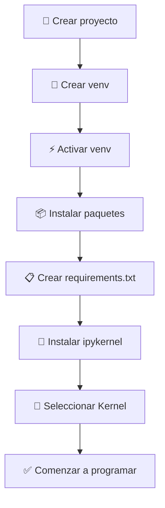

# 🐍 Guía Completa para Iniciar Proyectos en Python

> Una guía de referencia clara y orientada a principiantes para empezar **cualquier** proyecto en Python: entornos virtuales, instalación de paquetes, `requirements.txt`, Jupyter, kernels y buenas prácticas.

No se asume ningún conocimiento previo. Cada paso explica **qué** hacer, **cómo** hacerlo y, sobre todo, **por qué**.

---

## 📑 Tabla de contenidos

1. [¿Qué es un entorno virtual?](#1-qué-es-un-entorno-virtual-virtual-environment)
2. [¿Qué es `venv`?](#2-qué-es-venv)
3. [Crear un entorno virtual](#3-crear-un-entorno-virtual)
4. [Activar un entorno virtual](#4-activar-un-entorno-virtual)
5. [Desactivar el entorno virtual](#5-desactivar-el-entorno-virtual)
6. [¿Cómo saber si el entorno está activo?](#6-cómo-saber-si-el-entorno-virtual-está-activo)
7. [Instalar paquetes](#7-instalar-paquetes)
8. [Actualizar paquetes](#8-actualizar-paquetes)
9. [Ver los paquetes instalados](#9-ver-los-paquetes-instalados)
10. [Archivo `requirements.txt`](#10-archivo-requirementstxt)
11. [¿Qué es Jupyter Notebook?](#11-qué-es-jupyter-notebook)
12. [¿Qué es un Kernel?](#12-qué-es-un-kernel)
13. [Conectar un entorno virtual con Jupyter](#13-cómo-conectar-un-entorno-virtual-con-jupyter)
14. [Estructura básica recomendada de un proyecto](#14-estructura-básica-recomendada-para-un-proyecto-en-python)
15. [Primeros pasos al iniciar un proyecto](#15-primeros-pasos-al-iniciar-un-proyecto)
16. [Errores comunes y soluciones](#16-errores-comunes-y-soluciones)
17. [Buenas prácticas](#17-buenas-prácticas)
18. [Resumen visual](#18-resumen-visual)

---

## 1. ¿Qué es un entorno virtual (Virtual Environment)?

### Qué es

Un **entorno virtual** es una **carpeta aislada** dentro de tu proyecto que contiene su propia copia (o enlace) de Python y sus propios paquetes instalados.

Piénsalo como una **caja de herramientas separada para cada proyecto**: cada caja tiene exactamente las herramientas que ese proyecto necesita, ni más ni menos, y no se mezclan con las de otros proyectos.

### Para qué sirve

Sirve para que **cada proyecto tenga sus propias dependencias y versiones**, sin afectar a otros proyectos ni al Python del sistema operativo.

### Qué problema resuelve

Imagina esta situación real:

- El **Proyecto A** necesita `pandas` versión **1.5**.
- El **Proyecto B** necesita `pandas` versión **2.2**.

Si instalas los paquetes de forma **global** (en el Python del sistema), solo puede existir **una** versión de `pandas` a la vez. Actualizar para el Proyecto B **rompería** el Proyecto A. Esto se conoce como el *"infierno de las dependencias"* (*dependency hell*).

Un entorno virtual **resuelve** ese conflicto: cada proyecto guarda su propia versión sin pisar a los demás.

### Por qué es una buena práctica

- ✅ **Reproducibilidad:** cualquiera puede recrear tu entorno exacto.
- ✅ **Aislamiento:** un error en un proyecto no contamina a otros.
- ✅ **Limpieza:** tu Python del sistema se mantiene intacto.
- ✅ **Colaboración:** tu equipo trabaja con las mismas versiones que tú.

### Diferencia entre instalar paquetes globalmente y en un entorno virtual

| Aspecto | Instalación **global** | Instalación en **entorno virtual** |
|---|---|---|
| Ubicación | Python del sistema | Carpeta del proyecto (ej. `venv/`) |
| Alcance | Afecta a **todo** el equipo/PC | Afecta **solo** a ese proyecto |
| Conflictos de versiones | Muy frecuentes ⚠️ | Prácticamente eliminados ✅ |
| Riesgo de romper el sistema | Alto (especialmente en macOS/Linux) | Nulo |
| Reproducibilidad | Difícil | Fácil (`requirements.txt`) |
| Recomendado para | Casi nunca | **Siempre** ✅ |

> ⚠️ **Advertencia:** Instalar paquetes globalmente con `pip install` en macOS o Linux puede dañar herramientas del sistema que dependen del Python preinstalado. Usa **siempre** un entorno virtual.

---

## 2. ¿Qué es `venv`?

### Explicación de la librería estándar

`venv` es un **módulo incluido de serie en Python** (desde la versión 3.3). No necesitas instalar nada extra: si tienes Python 3, ya tienes `venv`.

Su única tarea es **crear entornos virtuales**.

### Cómo funciona

Cuando ejecutas `venv`, Python crea una carpeta nueva (por convención llamada `venv/` o `.venv/`) que contiene:

```
venv/
├── bin/        (o Scripts/ en Windows)  → ejecutables: python, pip, activate
├── lib/        → aquí se instalan los paquetes del proyecto
└── pyvenv.cfg  → archivo de configuración del entorno
```

Cuando **activas** el entorno, tu terminal empieza a usar el `python` y el `pip` de **esa carpeta** en lugar de los del sistema.

### Cuándo utilizarla

**Siempre** que empieces un proyecto nuevo en Python. Es el primer paso recomendado.

### Ventajas

- 🎯 **Incluido en Python:** cero instalaciones adicionales.
- 🪶 **Ligero:** crea entornos rápidamente.
- 🌍 **Estándar oficial:** funciona igual en Windows, macOS y Linux.
- 🤝 **Compatible con todo:** VS Code, Jupyter, pip, etc.

> 💡 **Nota:** Existen alternativas como `virtualenv`, `conda` o `poetry`. Para empezar, `venv` es la opción más simple y suficiente para la mayoría de proyectos.

---

## 3. Crear un entorno virtual

El comando base es el mismo en todos los sistemas. La estructura es:

```bash
python -m venv <nombre_del_entorno>
```

- `python` → llama al intérprete de Python.
- `-m venv` → ejecuta el módulo `venv`.
- `<nombre_del_entorno>` → el nombre de la carpeta que se creará (por convención `venv` o `.venv`).

> 💡 El nombre más usado es `venv`. Con un punto delante (`.venv`) queda "oculto" y VS Code lo detecta automáticamente.

### 🪟 Windows

```bat
python -m venv venv
```

Si `python` no funciona, prueba con el lanzador oficial de Windows:

```bat
py -m venv venv
```

### 🍎 macOS

```bash
python3 -m venv venv
```

> ⚠️ En macOS casi siempre se usa `python3`, porque `python` a secas puede no existir o apuntar a una versión antigua.

### 🐧 Linux

```bash
python3 -m venv venv
```

> ⚠️ En algunas distribuciones (Debian/Ubuntu) puede que necesites instalar el módulo primero:
> ```bash
> sudo apt install python3-venv
> ```

**Resultado:** En los tres casos se crea una carpeta `venv/` en tu proyecto. **Todavía no está activa** → ese es el siguiente paso.

---

## 4. Activar un entorno virtual

**Crear** el entorno no basta: hay que **activarlo** para empezar a usarlo.

### 🪟 Windows — CMD (Símbolo del sistema)

```bat
venv\Scripts\activate.bat
```

### 🪟 Windows — PowerShell

```powershell
venv\Scripts\Activate.ps1
```

> ⚠️ **Error frecuente en PowerShell:** si ves un mensaje sobre *"la ejecución de scripts está deshabilitada"*, ejecuta esto **una sola vez** y vuelve a intentar:
> ```powershell
> Set-ExecutionPolicy -ExecutionPolicy RemoteSigned -Scope CurrentUser
> ```

### 🍎🐧 macOS / Linux

```bash
source venv/bin/activate
```

### ¿Qué cambia al activarlo?

1. **Aparece el nombre del entorno** al inicio de la línea de tu terminal:
   ```
   (venv) usuario@equipo:~/mi-proyecto$
   ```
2. Los comandos `python` y `pip` ahora apuntan a la **carpeta del entorno**, no al sistema.
3. Todo lo que instales con `pip` se guardará **dentro** de `venv/`, aislado del resto.

> 💡 **Truco:** el `(venv)` al principio es tu confirmación visual de que todo está correcto.

---

## 5. Desactivar el entorno virtual

Cuando termines de trabajar, sal del entorno con un único comando (igual en **todos** los sistemas):

```bash
deactivate
```

### ¿Qué sucede al desactivarlo?

- Desaparece el `(venv)` de tu terminal.
- `python` y `pip` vuelven a apuntar al **Python del sistema**.
- El entorno **no se borra**: sigue ahí, listo para reactivarlo cuando quieras.

> 💡 No necesitas desactivar para cerrar la terminal: al cerrarla, el entorno se desactiva solo.

---

## 6. ¿Cómo saber si el entorno virtual está activo?

### Indicadores en la terminal

El indicador más claro es el **prefijo `(venv)`**:

```
(venv) C:\Users\pepita\mi-proyecto>      ← ACTIVO 
C:\Users\pepita\mi-proyecto>             ← NO activo 
```

### Comandos útiles para comprobarlo

**1. Ver qué `python` se está usando:**

```bash
# macOS / Linux
which python

# Windows (CMD)
where python

# Windows (PowerShell)
Get-Command python
```

Si la ruta apunta a tu carpeta `venv/`, ¡está activo!

```
/home/pepita/mi-proyecto/venv/bin/python    ← entorno virtual 
/usr/bin/python                             ← Python del sistema 
```

**2. Verificar la ruta desde dentro de Python:**

```bash
python -c "import sys; print(sys.prefix)"
```

Si imprime una ruta que incluye `venv`, el entorno está activo.

---

## 7. Instalar paquetes

### ¿Qué es `pip`?

`pip` es el **gestor de paquetes de Python**. Es la herramienta que **descarga e instala** librerías desde el repositorio oficial **PyPI** (*Python Package Index*, en https://pypi.org).

### Cómo funciona

```bash
pip install <nombre_del_paquete>
```

`pip` busca el paquete en PyPI, lo descarga junto con sus dependencias y lo instala. Si el entorno virtual está activo, lo instala **dentro** de `venv/`.

### Diferencia entre instalar global y en un entorno virtual

| | Global (`pip` sin entorno) | En entorno virtual (activo) |
|---|---|---|
| Dónde se guarda | Python del sistema | Carpeta `venv/` |
| A quién afecta | A todo el equipo | Solo a este proyecto |
| Recomendado | ❌ No | ✅ Sí |

> ⚠️ **Regla de oro:** Antes de `pip install`, **comprueba que ves `(venv)`** en tu terminal. Si no, lo instalarás en el lugar equivocado.

### Ejemplos reales

Paquetes muy comunes en análisis de datos y ciencia de datos:

```bash
pip install pandas        # Manipulación y análisis de datos (tablas)
pip install numpy         # Cálculo numérico y matrices
pip install matplotlib    # Gráficos básicos
pip install seaborn       # Gráficos estadísticos más bonitos
pip install scikit-learn  # Machine Learning
pip install plotly        # Gráficos interactivos
pip install jupyter       # Entorno de notebooks (completo)
pip install notebook      # Solo la app Jupyter Notebook clásica
```

**Instalar varios a la vez** (más rápido):

```bash
pip install pandas numpy matplotlib seaborn scikit-learn plotly jupyter notebook
```

**Instalar una versión concreta:**

```bash
pip install pandas==2.2.0
```

> 💡 **Consejo:** Instala solo lo que tu proyecto realmente necesita. Menos paquetes = menos problemas y entornos más ligeros.

---

## 8. Actualizar paquetes

### Actualizar un paquete a su última versión

```bash
pip install --upgrade pandas
```

`--upgrade` (o `-U`) le dice a `pip` que actualice el paquete si hay una versión más nueva.

**Actualizar el propio `pip`** (recomendable de vez en cuando):

```bash
python -m pip install --upgrade pip
```

### Cómo verificar la versión instalada

```bash
pip show pandas
```

Salida (resumida):

```
Name: pandas
Version: 2.2.2
Location: /home/pepita/mi-proyecto/venv/lib/python3.12/site-packages
```

> 💡 Fíjate en `Location`: confirma que el paquete está dentro de tu `venv/`.

También desde Python:

```bash
python -c "import pandas; print(pandas.__version__)"
```

> ⚠️ **Cuidado al actualizar:** una versión nueva puede cambiar comportamientos. Si un proyecto funciona, no actualices "porque sí". Actualiza con un motivo y prueba después.

---

## 9. Ver los paquetes instalados

### `pip list`

Muestra **todos** los paquetes instalados en formato legible (tabla):

```bash
pip list
```

```
Package         Version
--------------- -------
numpy           1.26.4
pandas          2.2.2
pip             24.0
```

### `pip freeze`

Muestra los paquetes en el **formato exacto** que usa `requirements.txt`:

```bash
pip freeze
```

```
numpy==1.26.4
pandas==2.2.2
```

### ¿Cuál usar?

| Comando | Formato | Uso principal |
|---|---|---|
| `pip list` | Tabla legible | Revisar a simple vista qué tienes |
| `pip freeze` | `paquete==versión` | Generar `requirements.txt` |

---

## 10. Archivo `requirements.txt`

### Qué es

Es un **archivo de texto plano** que lista todos los paquetes que tu proyecto necesita, con sus versiones exactas:

```txt
pandas==2.2.2
numpy==1.26.4
matplotlib==3.8.4
```

### Para qué sirve

Es la **"receta" reproducible** de tu proyecto. Permite que cualquier persona (o tu yo del futuro, o un servidor) instale **exactamente las mismas versiones** con un solo comando.

### Cómo generarlo

Con el entorno **activado**:

```bash
pip freeze > requirements.txt
```

Esto guarda la lista de `pip freeze` en el archivo `requirements.txt`.

### Cómo instalar dependencias desde él

Cuando alguien clona tu proyecto (o tú lo abres en otro PC):

```bash
pip install -r requirements.txt
```

`-r` significa *"read"* (leer): pip lee el archivo e instala todo lo que aparece.

### Buenas prácticas

- ✅ **Actualízalo** cada vez que instales o quites un paquete importante.
- ✅ **Súbelo a Git** (a diferencia de la carpeta `venv/`, que **nunca** se sube).
- ✅ Mantenlo **limpio**: incluye solo lo necesario para el proyecto.
- ✅ Para separar dependencias de desarrollo (tests, linters) puedes crear `requirements-dev.txt`.

> 💡 **Flujo típico:** instalo paquetes → `pip freeze > requirements.txt` → `git add requirements.txt`.

---

## 11. ¿Qué es Jupyter Notebook?

### Qué es

**Jupyter Notebook** es una herramienta que te permite escribir y ejecutar código Python en **celdas**, mezclándolo con texto explicativo, fórmulas, tablas y gráficos, todo en un mismo documento (archivo con extensión `.ipynb`).

### Para qué sirve

- 📊 **Análisis de datos:** ejecutar fragmentos de código y ver resultados al instante.
- 📈 **Visualización:** los gráficos aparecen justo debajo del código.
- 📝 **Documentar:** combinar explicaciones (en Markdown) con código.
- 🎓 **Aprender y enseñar:** ideal para experimentar paso a paso.

### Cuándo utilizarlo

| Usa Jupyter cuando... | Usa scripts `.py` cuando... |
|---|---|
| Exploras datos paso a paso | Construyes una aplicación |
| Pruebas ideas rápidamente | Automatizas tareas |
| Creas reportes con gráficos | Necesitas código reutilizable y testeable |
| Enseñas o aprendes | Despliegas a producción |

> 💡 Muchos proyectos usan **ambos**: notebooks para explorar y `.py` para el código final.

---

## 12. ¿Qué es un Kernel?

### Definición

Un **kernel** es el **"motor" que ejecuta el código** de tu notebook. Cuando escribes código en una celda y pulsas ejecutar, ese código se envía al kernel, que lo procesa y devuelve el resultado.

En la práctica, **un kernel = un intérprete de Python concreto** (con sus propios paquetes).

### Relación con el entorno virtual

Aquí está la clave 🔑:

- Cada **entorno virtual** tiene su propio Python y sus propios paquetes.
- Para que Jupyter use **ese** entorno, debe existir un **kernel** que apunte a él.
- Es decir: el kernel es el **puente** entre tu notebook y tu entorno virtual.

```
Notebook  →  Kernel  →  Entorno virtual (venv)  →  paquetes (pandas, numpy...)
```

### Por qué es importante seleccionar el kernel correcto

Si tu notebook usa el kernel **equivocado** (por ejemplo, el Python del sistema en vez de tu `venv`), **no encontrará los paquetes** que instalaste en el entorno virtual.

### Problemas comunes con el kernel equivocado

- ❌ `ModuleNotFoundError: No module named 'pandas'` aunque **sí** instalaste pandas (pero en otro entorno).
- ❌ Versiones de paquetes distintas a las que esperabas.
- ❌ El código funciona en la terminal pero **falla** en el notebook.

> ⚠️ **Síntoma típico:** "Instalé pandas pero el notebook dice que no existe". Casi siempre es **kernel equivocado**. Solución en la sección 13.

---

## 13. Cómo conectar un entorno virtual con Jupyter

Para que Jupyter pueda usar tu entorno virtual, debes **registrarlo como kernel**. Sigue estos pasos con el entorno **activado**.

### Paso 1 — Instalar `ipykernel`

`ipykernel` es el paquete que permite que un entorno se convierta en un kernel de Jupyter.

```bash
pip install ipykernel
```

### Paso 2 — Registrar el kernel

```bash
python -m ipykernel install --user --name=mi-proyecto --display-name "Python (mi-proyecto)"
```

Explicación de cada parte:

- `--user` → lo instala solo para tu usuario (no necesita permisos de administrador).
- `--name=mi-proyecto` → nombre **interno** del kernel (sin espacios).
- `--display-name "Python (mi-proyecto)"` → nombre **visible** que verás en la lista.

> 💡 Usa un nombre que identifique el proyecto, así no te confundes cuando tengas varios.

### Paso 3 — Seleccionarlo en VS Code

1. Abre tu archivo `.ipynb`.
2. Arriba a la **derecha**, haz clic en **"Select Kernel"** (Seleccionar kernel).
3. Elige **"Python (mi-proyecto)"** (o directamente la ruta a `venv/bin/python`).

> 💡 VS Code suele **detectar automáticamente** los entornos `venv` y `.venv` dentro de tu carpeta. Si no aparece, recarga la ventana (`Ctrl+Shift+P` → *"Reload Window"*).

### Paso 4 — Seleccionarlo en Jupyter Notebook (en el navegador)

1. Lanza Jupyter: `jupyter notebook`
2. Abre o crea un notebook.
3. Menú **Kernel → Change Kernel** (Cambiar kernel).
4. Selecciona **"Python (mi-proyecto)"**.

### Paso 5 — Cómo eliminar un kernel que ya no usas

**Ver los kernels registrados:**

```bash
jupyter kernelspec list
```

```
Available kernels:
  mi-proyecto    /home/pepita/.local/share/jupyter/kernels/mi-proyecto
  python3        /usr/local/share/jupyter/kernels/python3
```

**Eliminar uno:**

```bash
jupyter kernelspec uninstall mi-proyecto
```

> 💡 Eliminar un kernel **no borra** tu entorno virtual ni tus paquetes; solo quita la entrada de la lista de Jupyter.

---

## 14. Estructura básica recomendada para un proyecto en Python

Una estructura ordenada hace que tu proyecto sea fácil de entender y mantener:

```
mi-proyecto/
│
├── venv/                 ← entorno virtual (NO se sube a Git ⚠️)
│
├── data/                 ← datos del proyecto
│   ├── raw/              ← datos originales sin modificar
│   └── processed/        ← datos ya limpios/transformados
│
├── notebooks/            ← notebooks de Jupyter (.ipynb)
│   └── 01_exploracion.ipynb
│
├── src/                  ← código fuente reutilizable (.py)
│   ├── __init__.py
│   └── utils.py
│
├── README.md             ← documentación del proyecto
├── requirements.txt      ← lista de dependencias
└── .gitignore            ← qué archivos NO subir a Git
```

### Para qué sirve cada parte

| Elemento | Propósito |
|---|---|
| `venv/` | El entorno virtual aislado. **Nunca** se sube a Git. |
| `data/` | Almacena los datos. Separar `raw/` y `processed/` evita perder los originales. |
| `notebooks/` | Notebooks para explorar y analizar. Numerarlos (`01_`, `02_`) ayuda al orden. |
| `src/` | Código Python reutilizable (funciones, clases) que importas desde los notebooks. |
| `README.md` | Explica qué es el proyecto y cómo usarlo. **Lo primero que se lee.** |
| `requirements.txt` | La "receta" de dependencias para reproducir el entorno. |
| `.gitignore` | Lista de archivos/carpetas que Git debe **ignorar**. |

### Ejemplo de `.gitignore` para Python

```gitignore
# Entorno virtual
venv/
.venv/

# Archivos de Python compilados
__pycache__/
*.py[cod]

# Jupyter
.ipynb_checkpoints/

# Configuración de editores
.vscode/
.idea/

# Variables de entorno (¡secretos!)
.env

# Datos pesados (opcional, según el proyecto)
data/raw/
```

> ⚠️ **Muy importante:** la carpeta `venv/` puede ocupar cientos de MB y es específica de tu PC. **Nunca** se sube a Git; en su lugar se sube `requirements.txt`.

---

## 15. Primeros pasos al iniciar un proyecto

Flujo **completo desde cero**, explicando el porqué de cada paso. Sustituye `mi-proyecto` por el nombre real.

### 1️⃣ Crear la carpeta del proyecto

```bash
mkdir mi-proyecto
cd mi-proyecto
```

**Por qué:** todo proyecto vive en su propia carpeta. `cd` te mueve dentro de ella.

### 2️⃣ Abrir VS Code en esa carpeta

```bash
code .
```

**Por qué:** el `.` significa "la carpeta actual". Así VS Code abre el proyecto en su raíz y detecta bien el entorno.

### 3️⃣ Crear el entorno virtual

```bash
# Windows
python -m venv venv

# macOS / Linux
python3 -m venv venv
```

**Por qué:** aísla las dependencias de este proyecto desde el principio.

### 4️⃣ Activarlo

```bash
# Windows (CMD)
venv\Scripts\activate.bat

# Windows (PowerShell)
venv\Scripts\Activate.ps1

# macOS / Linux
source venv/bin/activate
```

**Por qué:** sin activarlo, `pip` instalaría en el sistema. Verifica que ves `(venv)`.

### 5️⃣ Instalar dependencias

```bash
pip install pandas jupyter ipykernel
```

**Por qué:** instalas lo que necesitas para empezar a trabajar (datos + notebooks + kernel).

### 6️⃣ Crear `requirements.txt`

```bash
pip freeze > requirements.txt
```

**Por qué:** dejas registrada la "receta" para que el entorno sea reproducible.

### 7️⃣ Registrar y seleccionar el kernel

```bash
python -m ipykernel install --user --name=mi-proyecto --display-name "Python (mi-proyecto)"
```

Luego, en VS Code: **"Select Kernel" → "Python (mi-proyecto)"**.

**Por qué:** así el notebook usará tu entorno virtual y encontrará los paquetes.

### 8️⃣ Crear el primer notebook

En `notebooks/`, crea un archivo `prueba.ipynb` (en VS Code: clic derecho → *New File* → `prueba.ipynb`).

### 9️⃣ Ejecutar una prueba con pandas

En la primera celda, escribe y ejecuta:

```python
import pandas as pd

datos = pd.DataFrame({
    "nombre": ["Pepita", "Luis", "Marta"],
    "edad": [25, 30, 28]
})

print("¡pandas funciona! Yayyyyy 🎉")
datos
```

**Resultado esperado:** una tabla con los datos y el mensaje de éxito. Si lo ves, ¡tu entorno está perfectamente configurado! ✅

---

## 16. Errores comunes y soluciones

### ⚠️ `ModuleNotFoundError: No module named 'pandas'`

**Causa:** El paquete no está instalado **en el entorno activo**, o el notebook usa el **kernel equivocado**.

**Solución:**
1. Verifica que ves `(venv)` en la terminal.
2. Reinstala: `pip install pandas`.
3. En el notebook, comprueba el kernel (sección 13) — debe apuntar a tu `venv`.

---

### ⚠️ `pip` no se reconoce como comando

**Causa:** El entorno no está activado o `pip` no está en el PATH.

**Solución:**
- Activa el entorno virtual primero.
- Usa la forma alternativa que **siempre** funciona:
  ```bash
  python -m pip install nombre_paquete
  ```

---

### ⚠️ `python` no se encuentra / "Python no encontrado"

**Causa:** Python no está instalado o no está en el PATH.

**Solución:**
- En **Windows**: prueba con `py` en lugar de `python`. Si tampoco, reinstala Python desde https://python.org y **marca la casilla "Add Python to PATH"** durante la instalación.
- En **macOS/Linux**: usa `python3` en lugar de `python`.

---

### ⚠️ El notebook no encuentra paquetes (kernel incorrecto)

**Causa:** El notebook está usando otro Python distinto al de tu `venv`.

**Solución:**
1. Comprueba qué Python usa el notebook ejecutando en una celda:
   ```python
   import sys
   print(sys.executable)
   ```
   Debe mostrar una ruta dentro de `venv/`.
2. Si no, cambia el kernel al de tu proyecto (sección 13).

---

### ⚠️ Instalé un paquete pero no aparece en `pip list`

**Causa:** Lo instalaste en un entorno (o sistema) distinto al que estás mirando.

**Solución:**
- Asegúrate de tener el **mismo entorno activado** al instalar y al listar.
- Verifica con `which python` (macOS/Linux) o `where python` (Windows).

---

### ⚠️ El entorno virtual no se activa (PowerShell)

**Causa:** PowerShell bloquea la ejecución de scripts por seguridad.

**Solución (ejecutar una vez):**
```powershell
Set-ExecutionPolicy -ExecutionPolicy RemoteSigned -Scope CurrentUser
```
Luego vuelve a activar con `venv\Scripts\Activate.ps1`.

---

### ⚠️ Problemas típicos en Windows

| Problema | Solución |
|---|---|
| `python` abre la Microsoft Store | Desactiva los "alias de ejecución de apps" en Configuración, o usa `py`. |
| Rutas con `\` no funcionan en algunas terminales | En Git Bash usa `/`: `source venv/Scripts/activate`. |
| Caracteres raros / tildes en rutas | Evita espacios y acentos en los nombres de carpetas del proyecto. |
| Antivirus bloquea la creación del entorno | Crea el proyecto fuera de carpetas protegidas (ej. evita `OneDrive`). |

---

## 17. Buenas prácticas

- 🚫 **No subas el entorno virtual a Git.** Añade `venv/` al `.gitignore`. Es pesado y específico de tu máquina.
- 📋 **Usa `requirements.txt`.** Es la forma estándar de compartir dependencias. Actualízalo cuando cambies paquetes.
- 🔄 **Mantén los paquetes actualizados** (con criterio). Actualiza con un motivo y prueba después; no rompas lo que funciona "porque sí".
- 📦 **Un entorno virtual por proyecto.** No reutilices el mismo `venv` para varios proyectos: pierdes el aislamiento.
- 🏷️ **Nombra bien tus proyectos y carpetas.** Usa minúsculas, sin espacios ni tildes (ej. `analisis-ventas`, no `Análisis Ventas`).
- ✅ **Activa el entorno antes de instalar.** Comprueba siempre el `(venv)`.
- 📝 **Escribe un buen README.** Explica qué hace el proyecto y cómo ejecutarlo.
- 🔐 **No subas secretos.** Contraseñas, tokens y claves van en un archivo `.env` (ignorado por Git), nunca en el código.

---

## 18. Resumen visual

### Diagrama del flujo (ASCII)

```
        ┌─────────────────────┐
        │   Crear proyecto    │   mkdir mi-proyecto && cd mi-proyecto
        └──────────┬──────────┘
                   ↓
        ┌─────────────────────┐
        │     Crear venv      │   python -m venv venv
        └──────────┬──────────┘
                   ↓
        ┌─────────────────────┐
        │    Activar venv     │   source venv/bin/activate
        └──────────┬──────────┘
                   ↓
        ┌─────────────────────┐
        │  Instalar paquetes  │   pip install pandas jupyter ipykernel
        └──────────┬──────────┘
                   ↓
        ┌─────────────────────┐
        │ Crear requirements  │   pip freeze > requirements.txt
        └──────────┬──────────┘
                   ↓
        ┌─────────────────────┐
        │ Instalar ipykernel  │   python -m ipykernel install --user ...
        └──────────┬──────────┘
                   ↓
        ┌─────────────────────┐
        │  Seleccionar Kernel │   "Select Kernel" en VS Code
        └──────────┬──────────┘
                   ↓
        ┌─────────────────────┐
        │ Comenzar a programar│   🎉
        └─────────────────────┘
```

### Diagrama del flujo (Mermaid)



---

## 🧾 Chuleta rápida de comandos

| Acción | Comando |
|---|---|
| Crear entorno | `python -m venv venv` |
| Activar (Win CMD) | `venv\Scripts\activate.bat` |
| Activar (Win PowerShell) | `venv\Scripts\Activate.ps1` |
| Activar (macOS/Linux) | `source venv/bin/activate` |
| Desactivar | `deactivate` |
| Instalar paquete | `pip install <paquete>` |
| Actualizar paquete | `pip install --upgrade <paquete>` |
| Ver paquetes | `pip list` |
| Generar requirements | `pip freeze > requirements.txt` |
| Instalar desde requirements | `pip install -r requirements.txt` |
| Registrar kernel | `python -m ipykernel install --user --name=mi-proyecto` |
| Listar kernels | `jupyter kernelspec list` |
| Eliminar kernel | `jupyter kernelspec uninstall mi-proyecto` |

---

> 💡 **Consejo final:** No memorices todo de golpe. Crea **un** proyecto siguiendo la sección 15 paso a paso y, en una semana, estos comandos serán automáticos. ¡La práctica es lo único que importa! 🚀
